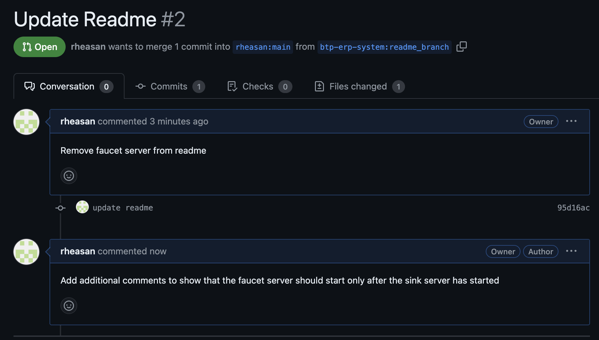

### Q1. Set your username and email in git config
```bash
git config --global user.name rheasan
git config --global user.email user@email.com
```

### Q2. Create a new branch named "feature-branch" and switch to it.
```bash
git checkout -b "feature-branch"
```

### Q3. List all branches in the repository.
```bash
git branch --list
```

### Q4. Delete the branch “feature-branch"
```bash
git branch -D "feature-branch"
```

### Q5. How do you undo the last commit
```bash
git reset HEAD~
```

### Q6. Create a new branch names “conflict-branch”
### Q7. Create a another branch named “feature1”
```bash
git checkout -b "conflict-branch"
git checkout -b "feature1"
```

### Q8.Make some changes in to feature1 branch


### Q9. Merge “feature1” branch into main branch

### Q10. Make changes in “conflict-branch”, in the same file and line that you had made changes in feature1

### Q11. Merge master into conflict-branch [Attach screenshot of terminal & file]
### Q12. Resolve merge conflicts


### Q13. Add a remote named "origin" pointing to a GitHub repository.
```bash
git remote add origin git@github.com:rheasan/chip8.git
```

### Q14. Fork a repository on GitHub and clone it to your local machine.
### Q15. Create a new branch on your fork, make changes, and open a pull request to the original repository.


### Q16. Comment on a PR and suggest improvements


### Q17. Create a Git alias for the command `git log --oneline` named `gitlol`.
```bash
git config --global alias.lol 'log --oneline'
```

### Q18. Create a pre-commit hook


### Q19. You have made local changes in your branch, but you need to switch to another branch urgently without committing. How would you handle this situation?
```bash
git stash
git switch "other branch"
```

### Q20. You accidentally deleted a file in your local repository. How do you restore it using Git?
```bash
git restore "file_name"
```

### Q21. You have committed changes to your branch but forgot to include a file. How do you add the file to the last commit without creating a new commit?
```bash
git add "new_file"
git commit --amend --no-edit
```

### Q22. You want to discard all changes in your working directory and revert to the last commit. What Git command would you use?
```bash
git reset --hard HEAD~
```

### Q23. You need to view a specific commit's changes. What Git command can be used to show the changes introduced by a particular commit?
```bash
git show "commit_hash"
```

### Q24. You want to change a commit message, after you have already committed, how do you do so?
```bash
git commit --amend -m "new message"
```

### Q25. Your colleague has made changes in their branch, and you want to incorporate those changes into your branch without merging. How do you achieve this?
```bash
git rebase "other branch"
```

### Q26. You've made several commits on a branch, but you want to club them into a single commit before pushing to the remote repository. How would you do that?
```bash
git reset --soft HEAD~N
git add -A
git commit
```

### Q27. You accidentally staged a file that you don't want to commit. How do you unstage it?
```bash
git restore --staged <file_name>
```

### Q28. You don’t want to commit files that have .yml in the end, and also files inside folder config. How do you do that?
add .yml and /config to .gitignore file

### Q29. You want to see a list of all the files changed in the last commit. What Git command would you use?
```bash
git show HEAD~1
```

### Q30. You realize that your local branch is outdated, and you want to fetch the latest changes from the remote repository. How do you do this without merging?
```bash
git fetch
```

### Q31. You accidentally deleted a branch. How do you recover it?
```bash
git checkout -b "branch_name" "branch_hash"
```

### Q32. You want to remove untracked files and directories from your working directory. What Git command would you use?
```bash
git clean -fd
```

### Q33. You have a commit from a feature branch that you want to apply to the main branch without merging the entire feature branch
```bash
git rebase "feature_branch" "main_branch"
```

### Q34. You mistakenly committed a change to the wrong branch and need to apply that commit to the correct branch.
```bash
git reset --soft HEAD~1
git stash
git switch "correct_branch"
git stash pop
git add -Ap
git commit
```

### Q35. There is a series of commits on a feature branch, but you only want to cherry-pick a specific range of commits.
```bash
git cherry-pick start_commit..end_commit
```

### Q36. You want to clone a GitHub repository onto your local machine, but you only need a specific branch. How can you achieve this?
```bash
git clone -b branch --single-branch git://repo.git
```

### Q37. You've made changes to your local repository and want to push them to your fork on GitHub. What Git commands would you use?
```bash
git add -Ap
git commit -m "message"
git push origin main
```

### Q38. You want to create a new branch both locally and on GitHub to work on a new feature. What commands would you use?
```bash
git checkout -b new_branch
git push origin new_branch
```

### Q39. You want to see the commit history of a GitHub repository. How can you do this using Git commands?
```bash
git log
```

### Q40. You've accidentally committed sensitive information and want to remove the commit from both your local and remote repositories on GitHub. What commands would you use?
```bash
git log #get hash of commit with sensitive info
git rebase -i commit_hash~
# change the offending commit from pick to drop
git add -Ap
git commit
git push -f
```

### Q41. You want to delete a remote branch on GitHub. What Git command would you use?
```bash
git push -d origin branch_name
git branch -D branch_name
```

### Q42. Create a git repository for all your assignments and upload them in it. Ask your peers to code review it, and you need to code review your peers assignments
```bash

```